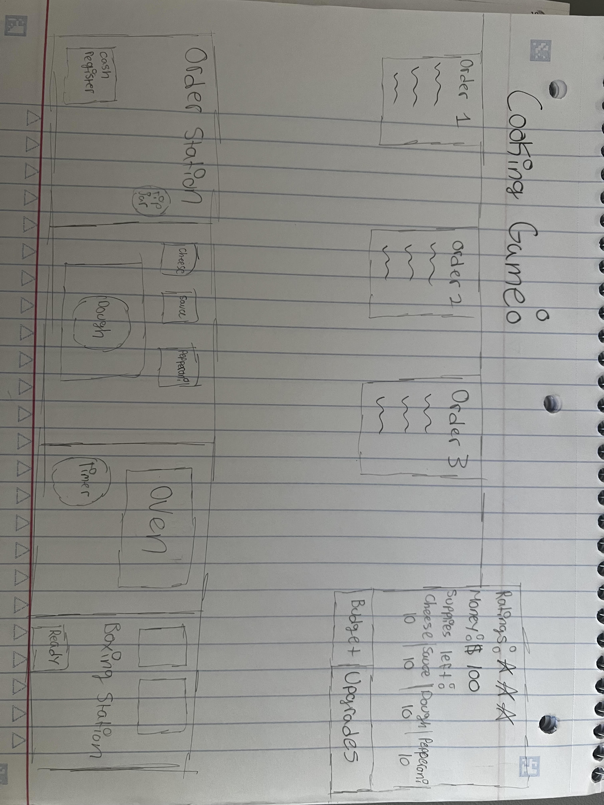

:warning: Everything between << >> needs to be replaced (remove << >> after replacing)

My Pizza Restaurant
## CS110 Final Project  Fall, 2024

## Team Members

Alisha Zubair

Antonella Gutierrez 

***

## Project Description
The concept for our game is a pizza cooking game in which the user is in charge of taking orders, preparing the pizza, and budgeting with the money that they make in order to continue buying supplies as they run out. The objective is to keep the restaurant open for as long as possible by correctly preparing orders and if they run out of budget/supplies the game will end.

***    

## GUI Design

### Initial Design

### Final Design

## Program Design

### Features

1. Start Menu
2. Game Screen
3. Menu/Order
4. Buying Supplies
5. Cooking stations

### Classes

- <<
1. Budgeting- Displays the players budget and decreases as supplies are bought.

2. Cooking- will display buttons for the player to select the dough, toppings, cook the pizza, and package it and give it to the costumer. Will also display a button which will allow the player to buy more cheese, pineapple, and pepperoni

3. Costumer- will display an order at the top of the screen 

4. Home- will display the homescreen which will include the name of the game and a start button

5. Music-Plays background music once game starts

6. Player- will take the order, follow the cursor through cooking stations, and use the budget to calculate spendings
>>

## ATP

| Step                 |Procedure             |Expected Results                   |
|----------------------|:--------------------:|----------------------------------:|
|  1                   | Run Counter Program  |GUI window appears with count = 0  |
|  2                   | click count button   | display changes to count = 1      |
etc...
