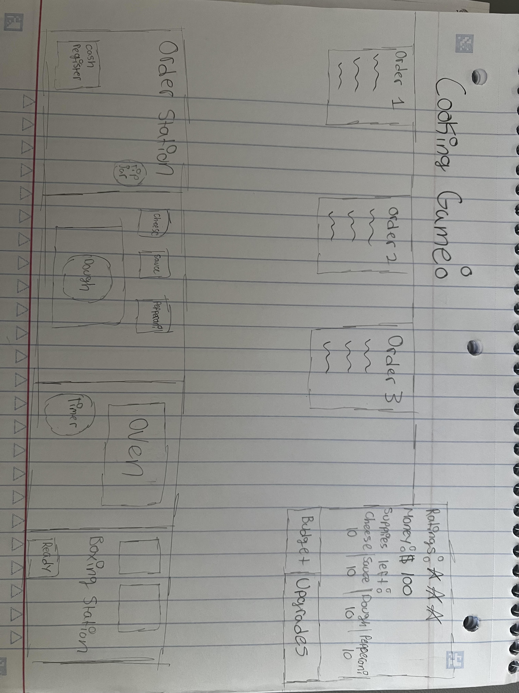

:warning: Everything between << >> needs to be replaced (remove << >> after replacing)

# << Project Title >>
## CS110 Final Project  << Semester, Year >>

## Team Members

Alisha Zubair

Antonella Gutierrez 

***

## Project Description
The concept for our game is a pizza cooking game in which the user is in charge of taking orders, preparing the pizza, and budgeting with the money that they make in order to continue buying supplies as they run out and buying upgrades such as faster cooking times, more toppings which can boost the restaurants rating, higher customer satisfaction points, and more. The objective is to keep the restaurant open for as long as possible and if they run out of budget/supplies the game will end.There will be random rush hours and reviewers that come in which affect the restaurant's rating more. There will also be a timer to show how long the restaurant has been running. Possibly: For the budgeting we will incorporate a feature in which based on the users usual earnings it can predict how much they will have after a certain amount of time played.  

***    

## GUI Design

### Initial Design

### Final Design

## Program Design

### Features

1. Start Menu
2. Game Over
3. Upgrades
4. Buying Supplies
5. Customer Ratings

### Classes

- << You should have a list of each of your classes with a description >>

## ATP

| Step                 |Procedure             |Expected Results                   |
|----------------------|:--------------------:|----------------------------------:|
|  1                   | Run Counter Program  |GUI window appears with count = 0  |
|  2                   | click count button   | display changes to count = 1      |
etc...
